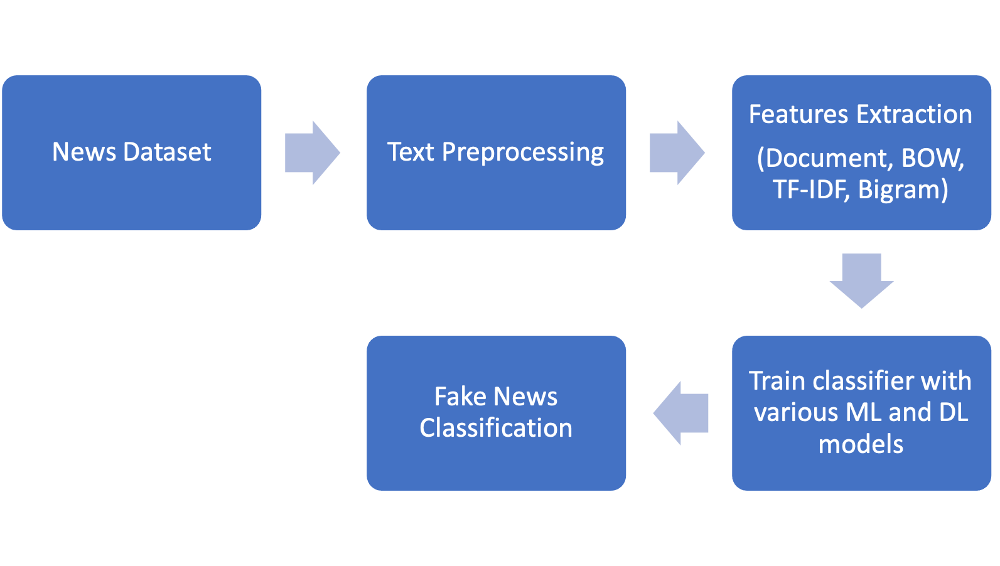

# Fake News Detection

We implement a fake news detection in this repository. This was a COMP755: Machine Learning project done by Bongsoo Yi, Chanhwa Lee, Wanyong Feng, and Shengjie Xu.

  
  

  Figure 1 - Overall Classification process of Fake News Detection

## Data

This project used following four datasets:

**Kaggle 1**     
https://www.kaggle.com/datasets/clmentbisaillon/fake-and-real-news-dataset

**Kaggle 2**          
https://www.kaggle.com/ksaivenketpatro/fake-news-detection-dataset

**Kaggle 3**           
https://www.kaggle.com/jruvika/fake-news-detection?select=data.csv

**LIAR**         
https://github.com/tfs4/liar_dataset

## Preprocessing

## Analysis

## Results
You can check the results in our final report `report.pdf`.
