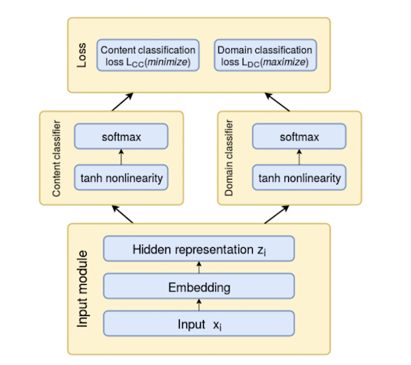

# Fake News Detection

We implement a fake news detection in this repository. This was a COMP755: Machine Learning project done by Bongsoo Yi, Chanhwa Lee, Wanyong Feng, and Shengjie Xu.

  
  

  Overall Classification process of Fake News Detection

## Data

This project used following four datasets:

**Kaggle 1**     
https://www.kaggle.com/datasets/clmentbisaillon/fake-and-real-news-dataset

**Kaggle 2**          
https://www.kaggle.com/ksaivenketpatro/fake-news-detection-dataset

**Kaggle 3**           
https://www.kaggle.com/jruvika/fake-news-detection?select=data.csv

**LIAR**         
https://github.com/tfs4/liar_dataset

## Preprocessing
Check `preprocessing.ipynb` for the preprocessing process.

## ML and DL Analysis
We implemented various machine learning and deep learning methods: Naive Bayes, Logistic Regression, SVM, Random Forest, Neural Network, BERT.

Check the following files:
* `NB_LR_SVM_RF.ipynb`: Naive Bayes, Logistic Regression, SVM, Random Forest
* `MLP.ipynb`: Neural Network
* `BERT.py`: BERT

## Domain Adaptation
Check `domain_adaptation.ipynb` for domain adaptation.

  
  

  Structure of the domain-independent model

## Results
Check our final report `report.pdf` for the results.
